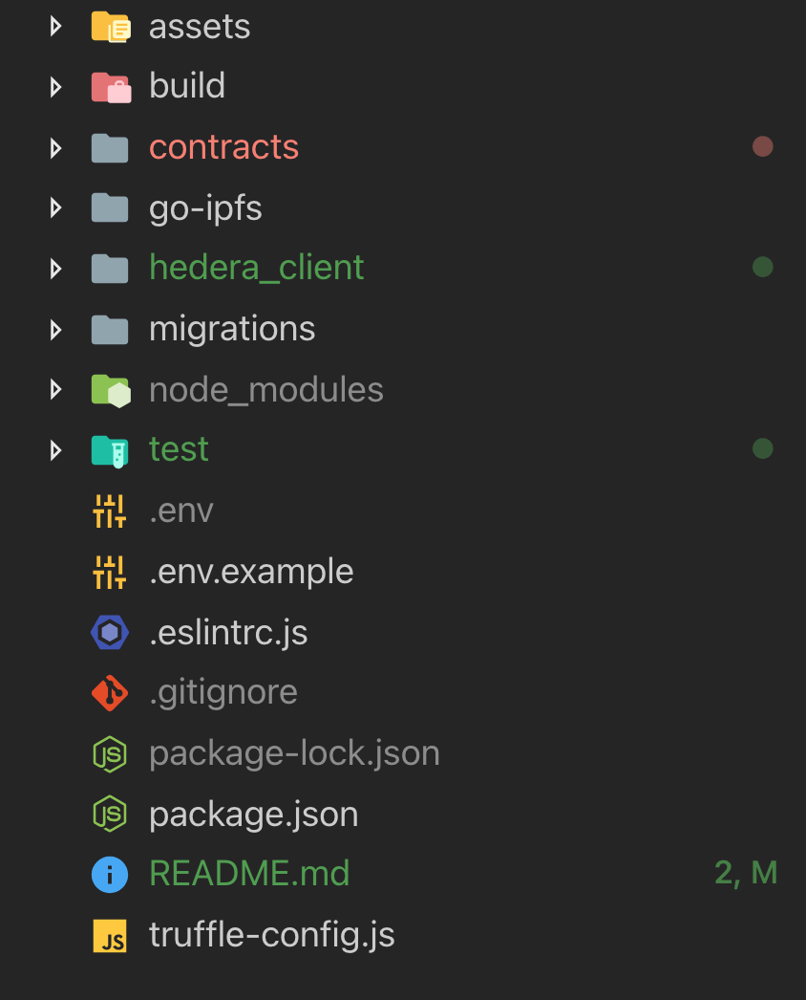
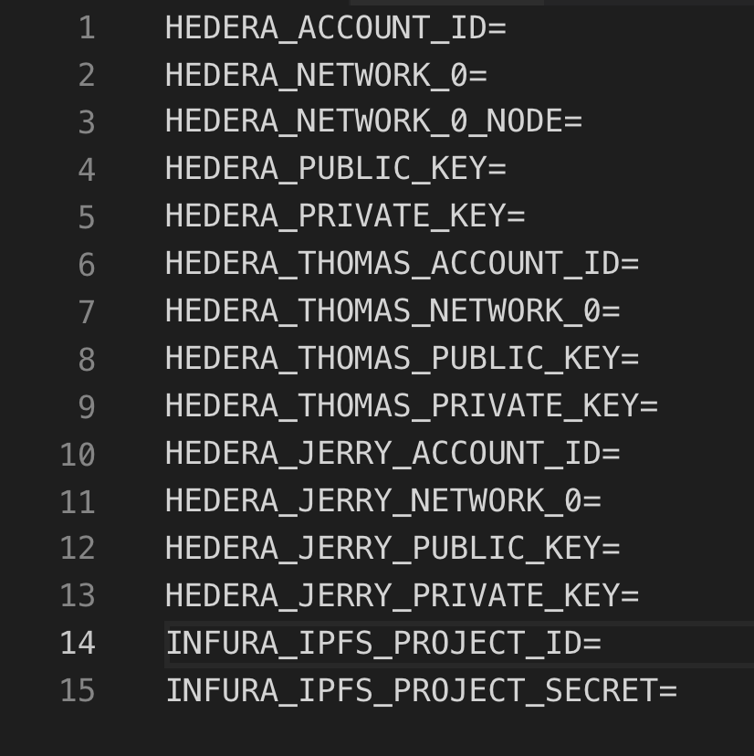
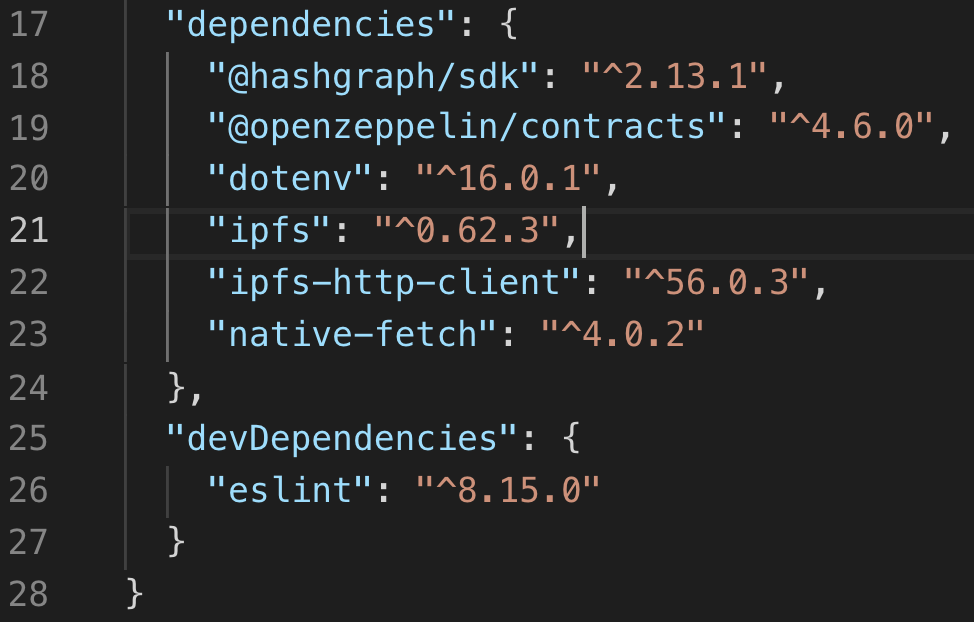
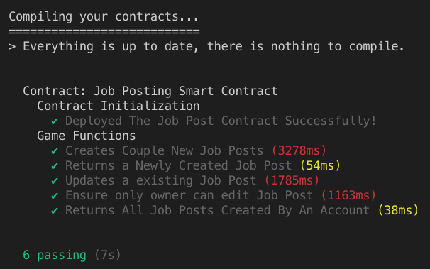
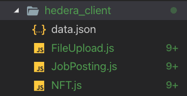
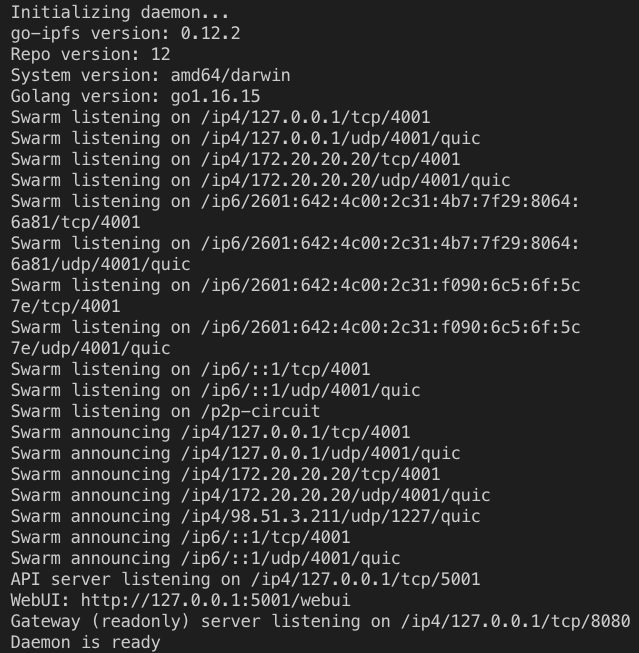
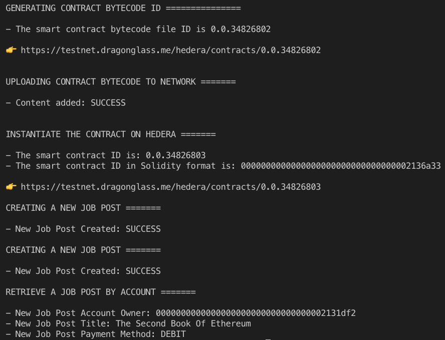
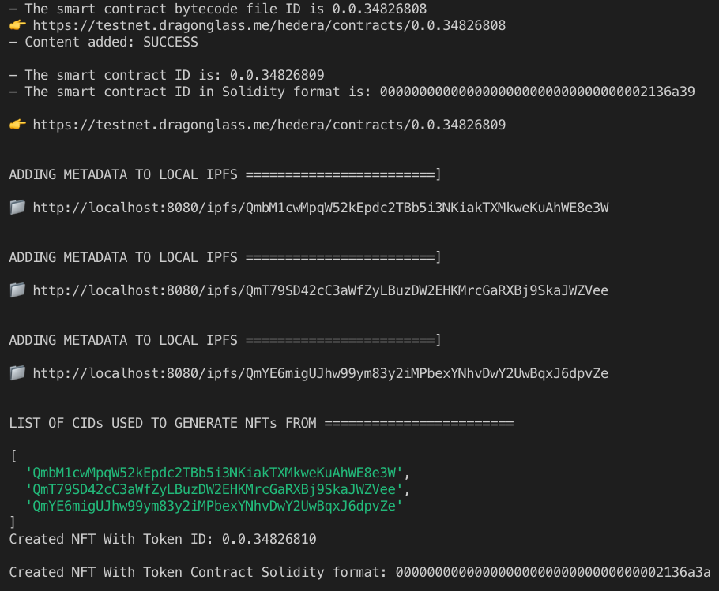
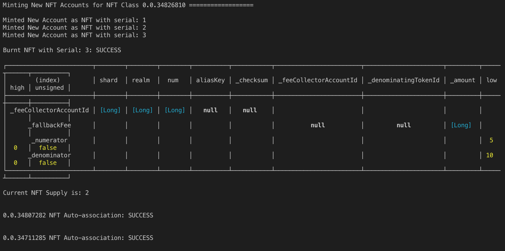
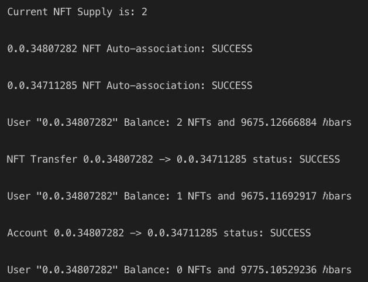

# Hedera Hackathon - 2022 by Thomas & Jerry

This project includes two main features:

- Create an NFT associated with a newly created account, using the Hedera Token Service SDK.
- Create a job posting Smart Contract In Solidity, associated with a user.
- Create a testcript that ensures the contract runs as expected.

## Test Accounts

In order to successfully test this app, it is recommended to create couple accounts:

- Hedera Test Account: Go to [portal.hedera.com](portal.hedera.com) and signup for a test account. After the process, save your credentials for later use (When we set environment variables for our app)
- Infura Account: Go to [Infura.io](Infura.io) and signup for a test account. Then create an IPFS project and save your credentials (projectId & projectSecret).

## Installation

Download the project from [github](https://github.com/watat83/Hedera-Hackathon-22.git) with the following command

```bash
> git clone https://github.com/watat83/Hedera-Hackathon-22.git
```

Once the download is complete, your project folder should look like this:



## Folder Structure

Looking at the folder, the most important files to explore are:

- build: This is where the solidity code from the `contracts` folder gets compile. The build folder contains a sub-folder `contracts` with a file called `JobPost.json` which is the Artifact of the contract. It contains the bytecode we will need to upload the contract to the Hedera network
- contracts: this is where the solidity code for the JobPost contract resides. All smart contracts are written inside the file.
- Test: this is where the test script (`test/JobPost.test.js`) of the contract `JobPost.sol` will reside. This script will run and make sure the contract was executed properly
- .env.example: This is where environment variables for your application will be stored. Make sure to update the variables with corresponding values. The file looks like this



- package.json: this is where all the dependencies and frameworks will be referenced. The dependencies currently installed are:



- truffle-config.js: This is where network configurations are made. We won't be touching this file at all.

Before moving to the next step, make sure to download and install [Node.js](https://nodejs.org/en/) for your operating system. Once installed, open the terminal inside the project folder and run the following commands, to install `truffle`, `ipfs` globally on your computer

```bash
> npm i -g truffle ipfs
```

Once that is complete, you can now install the dependencies defined inside your `package.json` file, like so

```bash
> npm i
```

To ensure that everything was installed properly, run the following command and the output should look like this

```bash
> truffle version

//Output
  Truffle v5.5.13 (core: 5.5.13)
  Ganache v^7.1.0
  Solidity - 0.8.13 (solc-js)
  Node v16.14.2
  Web3.js v1.5.3
```

## Usage

The first thing we need to update inside our project is the environment variables. So the first thing is:

- Edit the `.env.example` file to `.env` file.
- Open the file in a text editor and update the values as required, with the credentials created in a previous section (`HEDERA_ACCOUNT_ID`, `HEDERA_PUBLIC_KEY`, `HEDERA_PRIVATE_KEY`,`INFURA_IPFS_PROJECT_ID`, `INFURA_IPFS_PROJECT_SECRET`)

Once that is done, we are ready to test the app:

## Testing

Make sure you are inside the project folder and run the following command:

```bash
  > truffle compile

  //Output
    Compiling your contracts...
    ===========================
    > Compiling ./contracts/JobPost.sol
    > Artifacts written to <PROJECT_FOLDER>/build/contracts
    > Compiled successfully using:
      - solc: 0.8.13+commit.abaa5c0e.Emscripten.clang
```

This command will generate a `build/contracts` folder that holds the artifacts (ABI, bytecode, etc) of our smart contract (`build/contracts/JobPost.json` in our case). We will use this file to upload it to the Hedera Network.

#### Truffle Testing

Inside your project folder, run the following command to run the test script (`test/JobPost.test.js`) that ensures that the `contracts/JobPost.sol` smart contract behaves as expected.

```bash
  > truffle test

  // Output
    Compiling your contracts...
    ===========================
    > Everything is up to date, there is nothing to compile.


      Contract: Job Posting Smart Contract
        Contract Initialization
          ✔ Deployed The Job Post Contract Successfully!
        Game Functions
          ✔ Creates Couple New Job Posts (3278ms)
          ✔ Returns a Newly Created Job Post (54ms)
          ✔ Updates a existing Job Post (1785ms)
          ✔ Ensure only owner can edit Job Post (1163ms)
          ✔ Returns All Job Posts Created By An Account (38ms)

      6 passing (7s)

```



## Hedera Testing

In order to test our app on the Hedera Network, we will mainly focus on the `hedera_client/` folders, which holds all our scripts for Hedera.



- data.json: this represents the dummy data we will use a user profiles in order to gerate our NFT accounts.
  A list of user profiles looks like this:

```bash
  [{
    "name": "John Doe",
    "dob": "May 5th, 1998",
    "email": "john@doe.com",
    "profile": "https://linkToTheImageProfile.ext"
  }, {...}]
```

- FileUpload.js: This is the file responsible for metadata uploads to IPFS. More on this later.
- JobPosting.js: This file will interact will the artifacts (`build/contracts/JobPost.json`) we generated earlier from our smart contract (`contracts/JobPost.sol`).
- NFT.js: This is the file responsible for Creating NFT Collections, Minting NFTs, Associating NFTs to a specific user, Transferring NFTs between accounts, and exchanging value, on on the **Hedera Network**. This file will also call functions from the `FileUpload.js` script, to upload files to IPFS, while batch minting NFTs.

## Testing flow

#### - IPFS Daemon

To ensure that you can test file upload locally, make sure to

- Follow these instructions on [How To Install Go-IPFS](https://docs.ipfs.io/install/command-line/#system-requirements), then
- Run the following command, inside the project folder:

```bash
  > ipfs daemon

# Output
```



### hedera_client/JobPosting.js

To execute our `contracts/JobPost.sol` smart contract on the hedera network, let's run the following command:

```bash
  > node hedera_client/JobPosting.js

  #Output
  GENERATING CONTRACT BYTECODE ID ===============

  - The smart contract bytecode file ID is 0.0.34826802

  👉  https://testnet.dragonglass.me/hedera/contracts/0.0.34826802


  UPLOADING CONTRACT BYTECODE TO NETWORK =======

  - Content added: SUCCESS


  INSTANTIATE THE CONTRACT ON HEDERA =======

  - The smart contract ID is: 0.0.34826803
  - The smart contract ID in Solidity format is: 0000000000000000000000000000000002136a33

  👉  https://testnet.dragonglass.me/hedera/contracts/0.0.34826803

  CREATING A NEW JOB POST =======

  - New Job Post Created: SUCCESS

  CREATING A NEW JOB POST =======

  - New Job Post Created: SUCCESS

  RETRIEVE A JOB POST BY ACCOUNT =======

  - New Job Post Account Owner: 0000000000000000000000000000000002131df2
  - New Job Post Title: The Second Book Of Ethereum
  - New Job Post Payment Method: DEBIT

```



### hedera_client/NFT.js

To mint new NFTs on the Hedera Network, using the Hedera Token Service SDK, run the following command:

```bash
  > node hedera_client/NFT.js

  #Output

```





## Contributing

Pull requests are welcome. For major changes, please open an issue first to discuss what you would like to change.

Please make sure to update tests as appropriate.

<div style="width:100%;text-align:center">
  <h1>Author</h1>
  

Christian M. Nzouat  
 Blockchain & Software Architect  
 ✉️:  chris@Nzouat.com  
 📍: Nzouat, San Francisco-Bay Area, CA, US  
 🌐: https://nzouat.com

</div>
